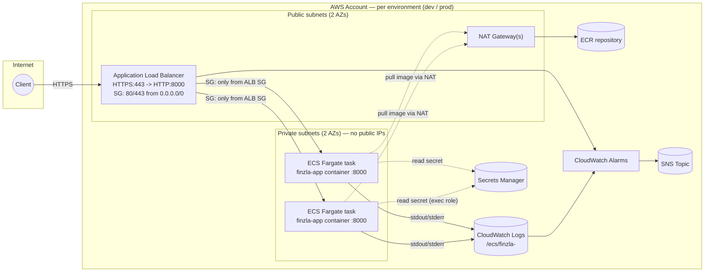

# Architecture Diagram

**Request path: Internet -> AWS -> Application**

1. A client resolves the ALB's DNS name (or a Route 53 record pointing at it) and sends an HTTPS request.
2. The request hits the **Application Load Balancer** in a public subnet. Its security group is the only thing in the VPC open to `0.0.0.0/0` (ports 80/443). Port 80 redirects to 443 once a certificate is attached.
3. The ALB terminates TLS and forwards plain HTTP on port 8000 to a healthy target — an **ECS Fargate task** running in a **private subnet**. The task's security group only accepts traffic from the ALB's security group; it has no route from the public internet at all, and no public IP.
4. The application handles the request and returns a response, which the ALB relays back to the client.
5. Outbound-only traffic from the task (pulling its image from ECR, calling CloudWatch/Secrets Manager APIs) leaves the private subnet through a **NAT Gateway** in the public subnet.

The container itself is never directly reachable from the internet — the ALB is the only ingress path, enforced by subnet placement (private subnets have no route to an Internet Gateway) and security groups (task SG only trusts the ALB SG).
